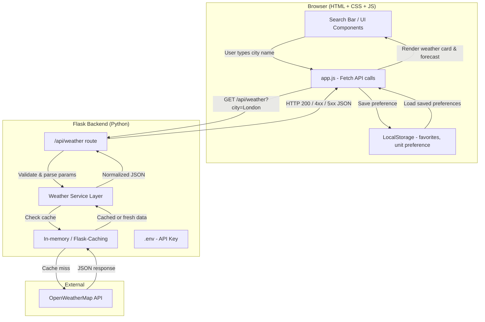
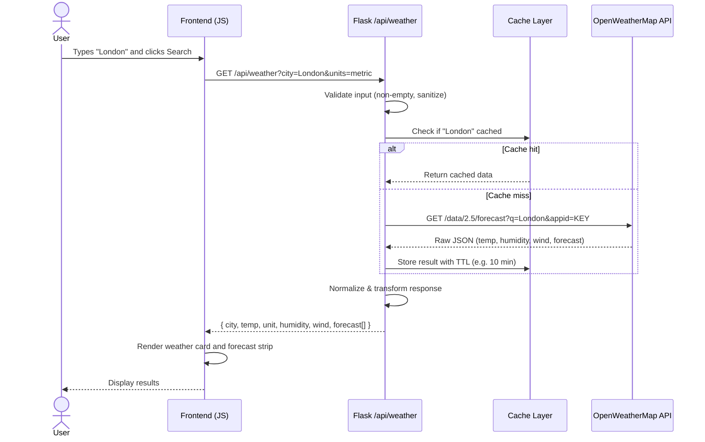

# Weather Dashboard App — Plan

## Functional Requirements

- Users can search for a city, ZIP code, or location name.
- The app shows current weather conditions: temperature, feels-like temperature, humidity, wind speed, pressure, visibility, and weather description.
- The app displays a multi-day forecast (hourly and daily views).
- The app shows weather icons or visuals that match current conditions.
- Users can switch between units (Celsius/Fahrenheit, metric/imperial wind units).
- The app can detect the user's current location if permission is granted.
- Users can save favorite locations and revisit them quickly.
- The app supports comparing weather across multiple saved cities.
- The app can show alerts or warnings for severe weather when available.
- The app supports refreshing weather data on demand.
- The backend fetches weather data from an external weather API.
- The backend validates user requests and handles missing, invalid, or unknown locations.
- The backend normalizes API responses into a consistent format for the frontend.
- The frontend renders loading, empty, and error states.
- The app persists user preferences (units, favorites, last searched location).
- The app shows metadata such as last updated time and data source.

## Non-Functional Requirements

- The UI is responsive and works on desktop, tablet, and mobile screens.
- The app loads quickly with optimized assets and minimal blocking scripts.
- Weather data fetching is resilient to API failures, timeouts, and rate limits.
- The system is secure: server-side validation, no API keys exposed to the frontend.
- The backend follows good error handling and returns clear, consistent API responses.
- The app is maintainable with separated concerns across presentation, client logic, and server logic.
- The codebase is easy to test with unit tests for frontend logic and backend routes/services.
- The app provides accessible UI behavior (keyboard navigation, sufficient color contrast).
- The app behaves consistently across modern browsers.
- The app is scalable to support more locations, users, and weather features later.
- The app uses caching to reduce repeated API calls and improve responsiveness.
- The app logs useful backend errors without exposing sensitive information to users.
- The UI remains usable under slow network conditions with clear loading/error states.
- The app is easy to deploy and configure using environment variables.

---

## User Stories

1. **Search by location**
   As a user, I want to search for a city or use my current location so that I can quickly see the weather for the place I care about.

   **Acceptance Criteria:**
   - Given the user enters a valid city or location, when they submit the search, then the app shows the current weather for that location.
   - Given the user enters an invalid or unknown location, when they submit the search, then the app shows a clear error message.
   - Given the weather data is loading, then the app shows a loading state.

2. **View current weather and forecast**
   As a user, I want to view the current weather conditions and a short forecast so that I can plan my day and upcoming days.

   **Acceptance Criteria:**
   - Given a location is selected, then the app displays current temperature, weather condition, humidity, wind speed, and other key details.
   - Given forecast data is available, then the app shows at least a 3-day or hourly forecast.
   - Given the data source returns updated information, then the app refreshes the display with the latest values.

3. **Switch temperature units**
   As a user, I want to switch between Celsius and Fahrenheit so that I can read temperatures in my preferred unit.

   **Acceptance Criteria:**
   - Given the user changes the unit setting, then the app converts temperatures between Celsius and Fahrenheit.
   - Given the unit preference is changed, then all displayed temperature values update consistently across the page.
   - Given the user revisits the app, then the previously selected unit remains saved.

4. **Save favorite locations**
   As a user, I want to save favorite locations so that I can return to them without searching again.

   **Acceptance Criteria:**
   - Given the user marks a location as a favorite, then the app saves it successfully.
   - Given the user opens the favorites list, then the saved locations are displayed.
   - Given the user selects a favorite location, then the app loads the weather for that location without requiring a new search.

---

## Architecture

### Component Overview

| Layer | Technology | Responsibility |
|---|---|---|
| Frontend | HTML + CSS + JS | Render UI, call backend, manage preferences in LocalStorage |
| Backend route | Flask `@app.route` | Validate input, orchestrate response |
| Service layer | Python module | Call external API, normalize data |
| Cache | Flask-Caching (simple/redis) | Reduce API calls, improve speed |
| Config | `.env` + `python-dotenv` | Keep API key off the frontend and out of source control |
| External API | OpenWeatherMap | Source of weather data |

### Architecture Diagram (Mermaid)



### Data Flow (Mermaid)



---

## Suggested Project Structure

```
weather-dashboard/
├── backend/
│   ├── app.py              # Flask app entry point
│   ├── routes/
│   │   └── weather.py      # /api/weather route
│   ├── services/
│   │   └── weather_service.py  # OpenWeatherMap API calls + normalization
│   ├── .env                # API key (not committed)
│   └── requirements.txt
├── frontend/
│   ├── index.html
│   ├── css/
│   │   └── styles.css
│   └── js/
│       └── app.js
└── README.md
```
